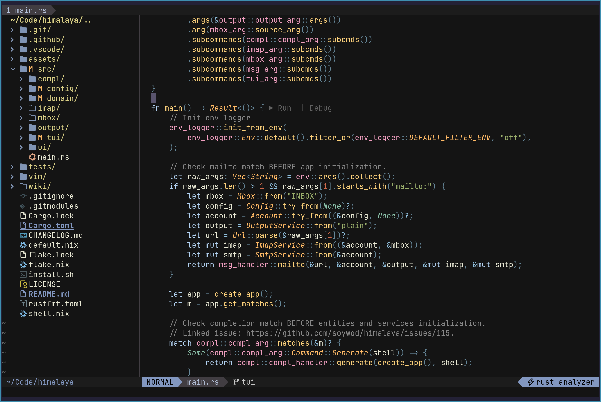

# nvim-jellybeans



## Install
**Note**: This `colorscheme` requires at least Neovim 0.5

Install with packer:
```lua
use { "kabouzeid/nvim-jellybeans", requires = "rktjmp/lush.nvim" }
```

Then activate with:
```viml
colorscheme jellybeans
```

---
**Credits**
Originally forked from [jellybeans-nvim](https://github.com/metalelf0/jellybeans-nvim).
